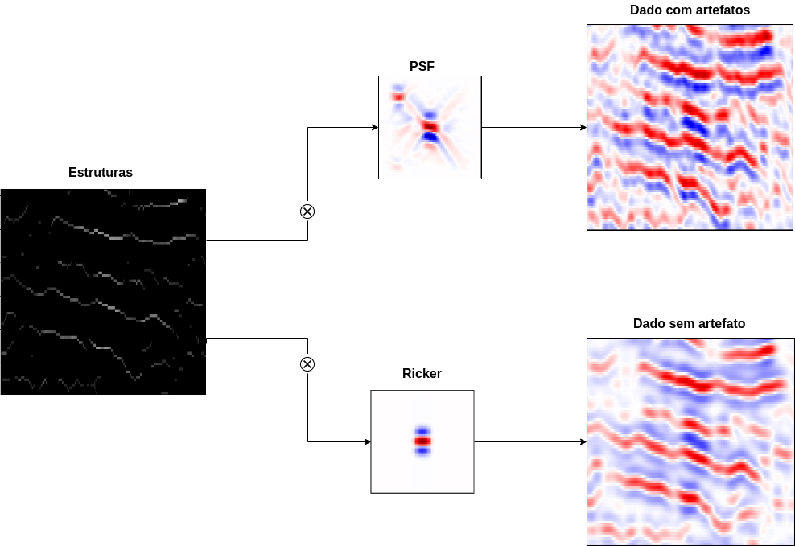

# Master's Project  

Project under development to obtain a master's degree in Computer Science, in partnership with the High-Performance Geophysics Laboratory (http://www.hpg.cepetro.unicamp.br/) of the University of Campinas. The project consists of the development of Generative Adversarial Networks (GANs) for the improvement of seismic data.

In this repository you will find the GANLib --- library that we developed for training GANS ---, methods of creating synthetic seismic data, implementations of well known GAN architectures (DCGAN, Pix2Pix, ...) and our own implemented architectures, besides several useful codes.

For more information, read EQM (Portugues).pdf or contact me.

## Some images related to the project.

### 
 Seismic experiment 

  

### 
 Real Sesmic Data 

  

### 
 Pix2Pix 

  

  

### 
 Solution of the Interpolation problem with Pix2Pix 

  

### 
 Generation of synthetic seismic data  

  

  

### 
 Synthetic samples 

  

### 
 Own main results 

  

